# 🌌 Stellar Shield Wallet

Stellar Shield Wallet is a React-based Web3 dashboard built for the Stellar Testnet. It combines Freighter wallet connectivity, real XLM / USDC / EURC transfers, Soroban smart contract interactions, wallet-specific transaction history, live Stellar network metrics, QR payment requests, security-focused transaction flows, and on-chain feedback analytics.

The project focuses on transparent verification: supported transactions expose their transaction hashes, Soroban interactions can be verified on Stellar Expert, and the analytics panel separates verified external tester activity from developer activity.

---

## 🎬 Project Demo Video

👉 

---

> **Live Demo (Vercel):** [🚀 Click Here to Open Live App](https://stellar-shield-wallet-v3-puce.vercel.app/)

> 💡 **Want to see the full, uncut workflow?**  
> If you would like to watch the complete step-by-step wallet connection, multi-asset transfer processes, and live network confirmations in full detail, you can watch our comprehensive video here:
> 👉 **[Click Here to Watch the Full Detailed Project Demo Video](https://drive.google.com/file/d/1Zzi0ePz9l-t_eatqX5D8_e62atrYPNhD/view)**

---

## 🚀 Features

- 🔐 **Freighter Wallet Integration:** Connects to the active Freighter account, restores the connected wallet on refresh, and synchronizes real Stellar Testnet balances.

- 💸 **Real Multi-Asset Transfers — XLM / USDC / EURC:** Builds, signs, and submits real Stellar Classic payment operations through Freighter + Horizon. USDC and EURC transfers validate the exact Testnet issuer and require valid trustlines on both source and destination accounts.

- 🪙 **Live Multi-Asset Balance Sync:** Reads the connected account directly from Horizon and synchronizes native XLM plus the configured USDC and EURC trustline balances.

- ✅ **Verified Transaction History:** Successful Classic transfers are stored with the real Horizon transaction hash and verifiedOnChain: true. Explorer links are only enabled for verified 64-character Stellar transaction hashes; legacy/local records remain clearly marked as UNVERIFIED.

- 📤 **Transaction History CSV Export:** Exports the currently visible transaction-history results while respecting active search and date filters.

- ⚡ **Soroban create_feedback Interaction:** Builds, prepares, signs, submits, retries, and confirms Soroban Testnet transactions through Stellar RPC.

- 🧠 **Soroban Transaction Reliability:** Uses prepareTransaction, fresh account sequence reads, retry handling for temporary network congestion, txBadSeq rebuild protection, and final ledger-confirmation polling before the UI reports success.

- 🔗 **Verified Soroban History:** Confirmed Soroban operations now persist their real RPC transaction hash in Transaction History. Fake/fallback transaction hashes are not treated as verified blockchain proof.

- 🟢 **Live Broadcast Success UI:** Displays confirmed transaction hashes after successful on-chain operations and provides Stellar Expert links only for records that passed the application's verification guard.

- 📊 **Live Stellar Network Metrics:** Refreshes every 15 seconds and displays the current base fee, network capacity usage, average ledger close time, Soroban inclusion fee (p50), protocol version, and a derived OPTIMAL / BUSY / CONGESTED dashboard status.

- 👥 **Verified User Analytics:** Tracks real fb_live on-chain interactions, deduplicates wallets, excludes both legacy and current developer wallets from the external tester count, and merges live RPC activity with previously verified historical records when older events leave the active RPC retention window.

- 💬 **Tester Feedback Filter:** Separates verified external tester feedback from developer/demo activity so real tester comments can be reviewed independently.

- 🧾 **Wallet-Specific Persistent Transaction History:** Stores history under a wallet-specific localStorage key so different Freighter accounts in the same browser do not share transaction records. Includes All, Today, This Week, and This Month filters plus search by destination or transaction hash.

- 🔲 **Dynamic QR Payment Request:** Generates Stellar payment QR codes from the connected public key with optional numeric amount and sanitized memo fields.

- 📇 **Validated Address Book:** Prevents duplicate contact names and duplicate wallet addresses and supports quick-transfer workflows.

- 🛡️ **Security Audit & Confirmation UI:** Includes security-oriented confirmation flows, simulated audit/error scenarios, and explicit user approval before signing sensitive actions.

- 🛑 **Network-Aware Error Handling:** Handles rejected signatures, temporary Soroban RPC conditions, failed contract execution, sequence synchronization, delayed confirmations, Horizon transaction result codes, missing trustlines, insufficient balances, and invalid destinations.

- 🌗 **Dark / Light Theme:** Provides a cyber-styled dark dashboard and a high-contrast light interface.

- 📈 **Asset Flow Chart:** Recharts visualization synchronized with real Testnet balance refreshes after supported transactions.

- 📘 **Integrated User Guide:** In-app guidance for connecting Freighter, using the transfer engine, interacting with the Soroban contract, verifying transactions, and obtaining Testnet assets. The guide can be accessed before completing the full wallet workflow.

- 📏 **Responsive Dashboard Layout:** Responsive layouts, interactive cards, status panels, and locally built Tailwind CSS transitions designed for a consistent Web3 dashboard experience.

---

## 🪙 Configured Stellar Testnet Assets

| Asset    | Type               | Issuer                                                     |
| -------- | ------------------ | ---------------------------------------------------------- |
| **XLM**  | Native             | Native                                                     |
| **USDC** | `credit_alphanum4` | `GBBD47IF6LWK7P7MDEVSCWR7DPUWV3NY3DTQEVFL4NAT4AQH3ZLLFLA5` |
| **EURC** | `credit_alphanum4` | `GB3Q6QDZYTHWT7E5PVS3W7FUT5GVAFC5KSZFFLPU25GO7VTC3NM2ZTVO` |

> USDC and EURC transfers require the correct Testnet trustline on both the sender and recipient account.

## ⛓️ Smart Contract Deployment Details (Jury Verification)

- **Target Contract Address (Testnet):** `CDQUFGNQGT3CYQYNM4DUNZRLBARAXWNGJQW466OYZOODPHLXT2Z3AXMI`
- **Verifiable Transaction Hash (Successful Contract Call):** `44553efa132d580cddab3070361e4c63b8abf9fbb1318d7052082b252f742c42`
- **Explorer Link:** [View Successful Contract Transaction on Stellar Expert](https://stellar.expert/explorer/testnet/tx/44553efa132d580cddab3070361e4c63b8abf9fbb1318d7052082b252f742c42)

> 🛡️ **Jury Note on Verification:**  
> The current Soroban interaction calls the deployed contract's `create_feedback` function. The amount entered in the crowdfunding-style demo interface is included inside the feedback payload, for example `"Simulated deposit of 5 XLM!"`.
>
> The transaction itself is cryptographically signed and confirmed on the Stellar Testnet; however, this flow does **not** transfer or lock the entered XLM amount inside the smart contract.


---

## 🛡️ Important Soroban `deposit()` Explanation

The crowdfunding-style `deposit()` interface currently invokes the deployed contract's:

```text
create_feedback
```

function.

For example:

```text
Simulated deposit of 260 XLM!
```

The entered amount is included in the feedback payload.

The Soroban transaction itself is:

- ✅ Cryptographically signed through Freighter
- ✅ Submitted to Stellar Testnet
- ✅ Confirmed through Stellar RPC
- ✅ Assigned a real Stellar transaction hash
- ✅ Verifiable on-chain

However, the current `create_feedback` smart contract method does **not** transfer or lock the entered XLM amount inside the contract.

Therefore, the crowdfunding-style amount must be understood as a **Soroban interaction input/demo value**, not as an XLM custody deposit.

### ✅ Verified Soroban Deposit / Contract Interaction

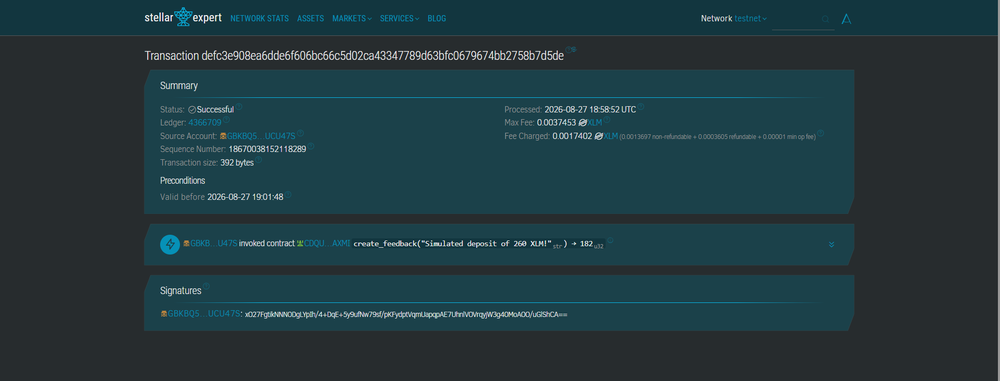

## 🔎 Recent On-Chain Verification Improvements

The transaction-verification architecture was hardened so UI state cannot be confused with blockchain truth.

### Classic Stellar Transactions

XLM, USDC, and EURC history entries are only marked as verified after Horizon successfully accepts the signed transaction.

```text
Freighter Signature
        ↓
Horizon Submission
        ↓
Successful Network Result
        ↓
Real Transaction Hash
        ↓
verifiedOnChain: true
```

### Soroban Transactions

Soroban interactions are only treated as verified after Stellar RPC reports final:

```text
SUCCESS
```

### Transaction Explorer Guard

Explorer links are enabled only when:

```js
verifiedOnChain === true;
```

and the transaction hash matches:

```text
64 hexadecimal characters
```

### Legacy Records

Old/local transaction records without network proof remain visible but are labeled:

```text
UNVERIFIED
```

This prevents generated IDs or UI-only success states from being presented as blockchain proof.

---

## 🛠️ Installation & Local Setup

Follow these steps to run the project locally on your machine:

1. **Clone the Repository:**

   ```bash
   git clone https://github.com/mustafaColak0/stellar-shield-wallet-v3.git
   cd stellar-shield-wallet-v3
   ```

2. **Install Dependencies:**

   ```bash
   npm install --force
   ```

3. **Start the Development Server:**
   ```bash
   npm start
   ```
   Your browser will automatically open the project at http://localhost:3000 .

---

## 📸 Submission Proofs

💡 **Jury Evaluation Note:** The visual proofs for the project requirements and implemented Stellar / Soroban features are mapped below.

1. Wallet Connected State & Live Dashboard (Dashboard Overview)
   Proof of successful Freighter wallet connection showing the active Testnet account, real XLM balance, live Stellar network metrics, base fee, network capacity, ledger close time, Soroban inclusion fee, protocol version, and the dynamic asset flow chart:
   

2. Multi-Asset Transfer Engine with Compliance Filters
   The transfer panel supports real Stellar Testnet XLM, USDC, and EURC transfers through Freighter and Horizon. Issued-asset transfers validate the configured issuer, source balance, and required trustlines before signing. The interface also includes compliance-oriented status panels, integrated quick contacts, security confirmation, and the transaction signing workflow:
   
   
   
   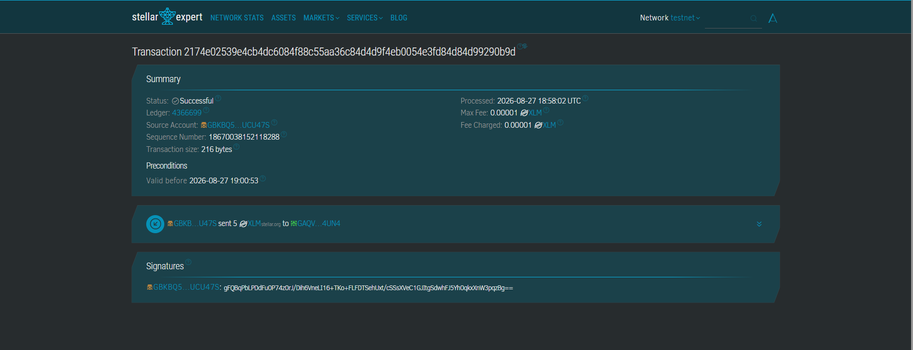
   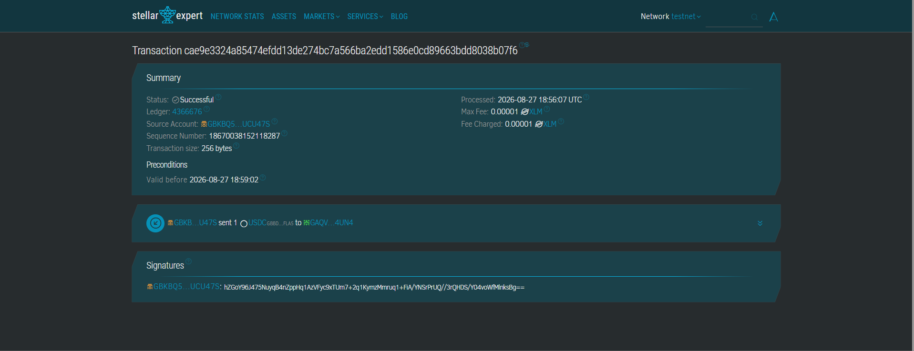
   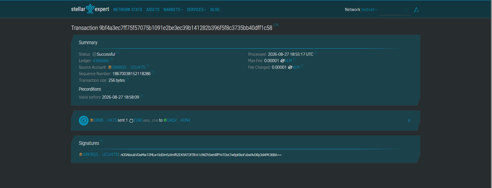

3. Dynamic QR Code Peer-to-Peer Payment Request Engine
   A real-time payment address sharing layout that generates a high-contrast QR code corresponding to the connected user's public key, with optional amount and memo fields:
   

4. Level 2 Security Audit & Soroban Interaction Matrix
   The centralized security-oriented sandbox showing audit simulations, cryptographic signing states, transaction monitoring, and exception / abort test handlers:
   

## Loading & Error Handling Proofs

Stellar Shield provides visible runtime loading states and graceful failure handling for both simulated wallet exceptions and real Stellar network interruptions.

- **Loading State:** The Security Audit Center displays an active `SCANNING LEDGER...` state while the audit process is running.
- **Wallet Rejection Simulation:** The `REJECT 401` test validates the UI and exception-handler response to a rejected wallet signature. This test is explicitly simulation-only and does not broadcast a transaction.
- **Insufficient Balance Simulation:** The `BALANCE 402` test validates the application's failure-state UI for insufficient-balance scenarios. This test is explicitly simulation-only.
- **Real Network Failure Handling:** When Stellar Testnet endpoints become unreachable, the dashboard falls back to an `UNAVAILABLE` network state instead of crashing.

<p align="center">
  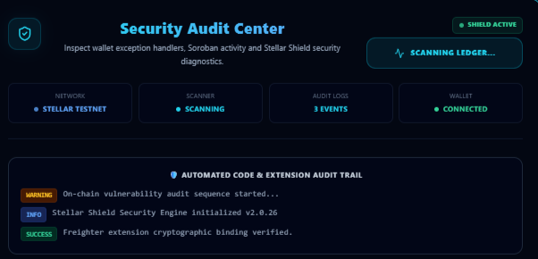
  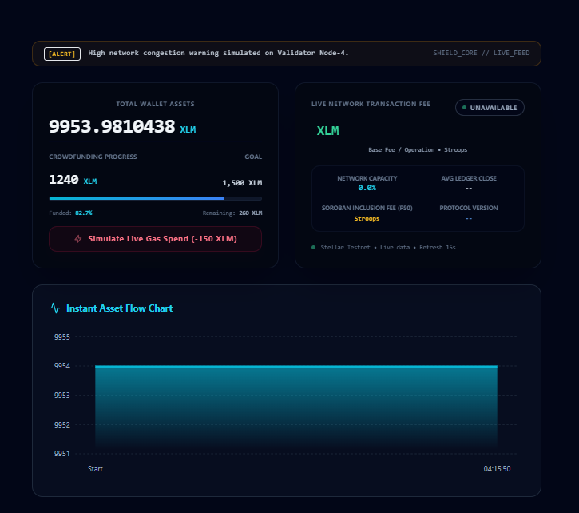
</p>

<p align="center">
  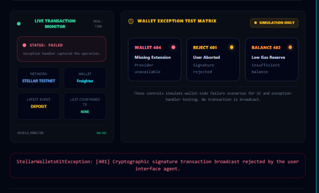
  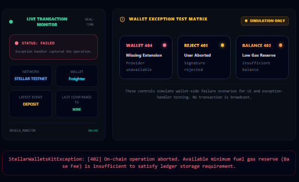
</p>

5. Soroban Contract Interface & Emitted Event Timeline
   The Soroban interaction panel contains a crowdfunding-style demonstration interface, cryptographically signed `create_feedback` contract interactions, transaction confirmation states, and live contract event visualization:
   
   

6. Integrated Address Book for Verified Test Accounts
   A local registry allowing users to manage, save, and launch quick-transfer workflows directly to saved Stellar wallet addresses:
   

7. Verified Transaction History
   A wallet-specific transaction-history interface that provides real transaction hashes, verified and unverified status indicators, Stellar Expert verification links, Soroban interaction labels, destination and transaction-hash search, date-based filters, wallet-specific persistence, and CSV export functionality.
   
   

8. Automated CI/CD Pipeline & Smart Contract Unit Tests (Level 3 Core Requirement)
   Proof of the GitHub Actions workflow execution. The pipeline compiles the repository, executes Soroban unit tests, validates the frontend build, and reports the workflow result:
   
   

9. Smart Contract Unit Test Execution Output (3/3 Passed)
   

### 10. Soroban Smart Contract Feedback Matrix (Level 3 Architecture)

A feedback and status verification module integrated with smart contracts running live on the Soroban Testnet network:

- **Create Feedback:** Records feedback through the create_feedback contract function.
- **On-Chain Verification:** Displays confirmed transaction hashes and network validation status for supported contract interactions.
- **Verified Tester Analytics:** Separates real external tester activity from developer activity and provides a dedicated Testers feedback filter.
- **Unique Wallet Tracking:** Counts verified external wallets toward the testing target while excluding developer wallets.
- **Retention-Aware Recovery:** Previously verified historical transactions can be merged with recent RPC results when older Testnet events fall outside the RPC retention window.


---

### 11. Responsive Mobile Experience

Stellar Shield includes a responsive mobile interface designed to preserve the core wallet, transfer, analytics, and security workflows on smaller screens.

The screenshots below demonstrate the responsive dashboard and transaction experience on mobile viewport sizes.

<table>
  <tr>
    <td align="center" valign="top">


</td>
 <td align="center" valign="top">
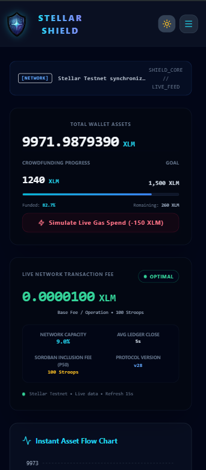

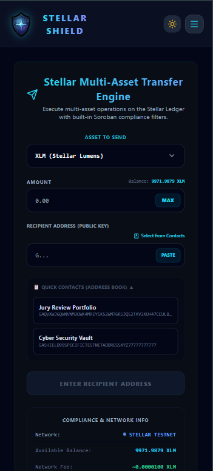

   </td>
  </tr>

   <tr>
    <td align="center" valign="top">
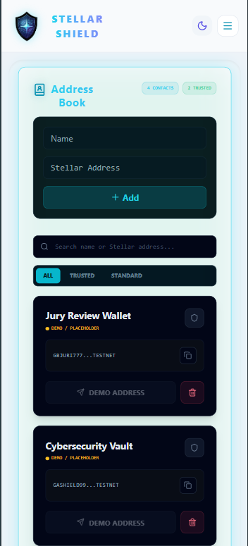
      
</td>
    <td align="center" valign="top">
      
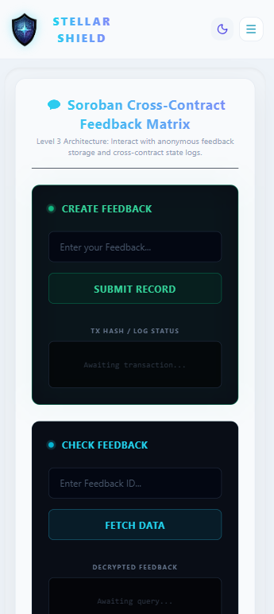
  
 </td>
  </tr>
</table>

## 👥 Live Analytics & Real-User Testing (Level 4 Progress)

StellarShield now includes a dedicated live analytics panel for external testing:

- **Verified Unique Wallets:** Counts unique wallets with confirmed `fb_live` activity.
- **Developer Exclusion:** Developer wallets remain visible in the event stream but are excluded from the external tester target.
- **Tester Feedback Filter:** Displays external tester comments separately from developer/demo feedback.
- **Verified Event Persistence:** Previously observed verified activity is preserved locally even when older RPC events move outside the active retention window.
- **Unique User Validation:** Repeated interactions from the same wallet do not increase the verified unique wallet count.
- **Current Verified Evidence Set:** 10 unique external tester wallets have been independently identified from real on-chain interaction evidence collected during testing.

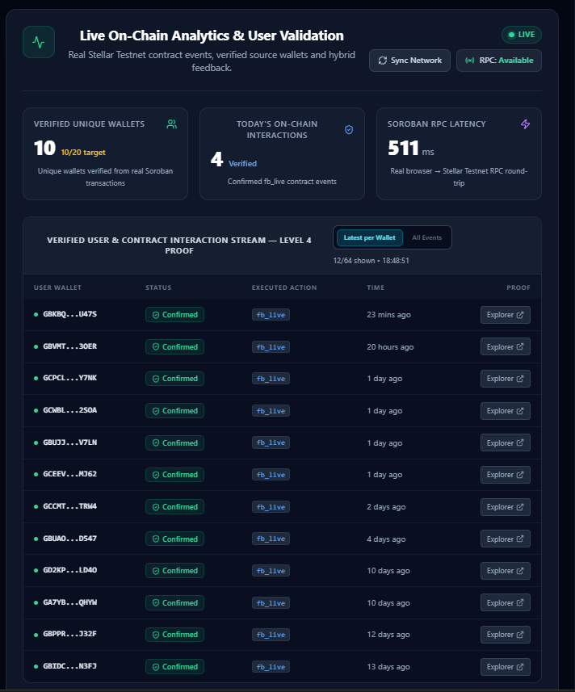

### 💬 Verified External Tester Feedback

The screenshots below show feedback submitted by verified external Stellar Testnet wallets.

Each `Verified On-Chain` entry is associated with real tester activity observed through the Stellar Shield analytics pipeline.

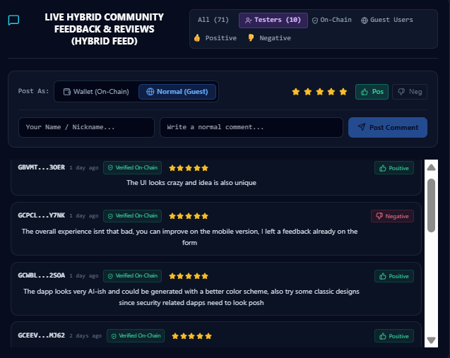

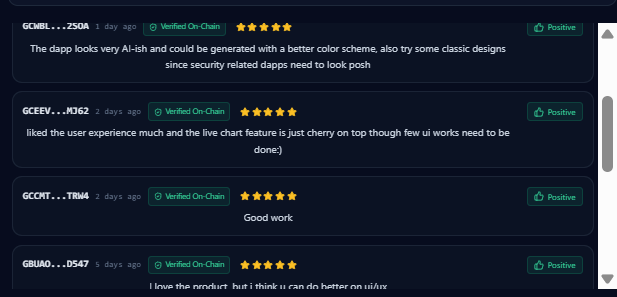

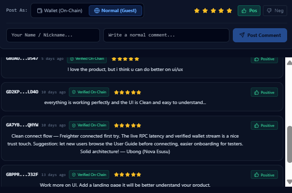

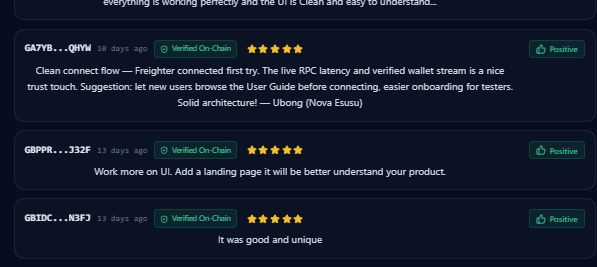

> 🚧 **Current Status:** External testing and proof collection are continuing. The analytics count is based on unique verified wallets, not raw event count.

## User Feedback

We collect user feedback through Google Forms and use the results to improve:

- UI / UX
- Transaction workflows
- Onboarding
- Wallet interactions
- Security-focused functionality

📝 [Share your feedback](https://docs.google.com/forms/d/e/1FAIpQLScdB-Kdr1fzhEaM2YNk22lubI09lZcpcztqGGDoyTgDjdBbfQ/viewform) — takes ~1 minute.

---

### 📊 Tester Feedback Dataset

An anonymized export of the tester feedback used during the evaluation process is included in the repository.

[📥 Download Anonymized Tester Feedback Dataset](docs/data/stellar_shield_tester_feedback_anonymized.xlsx)

> Personal information such as names and email addresses has been removed from the public dataset.

## 🔁 Feedback-Driven Iteration

Every round of user feedback helps us shape the next iteration. Here is how we are addressing the tester feedback:

| User Feedback                                                                                           | Action Taken / Improvement                                                                                                    |         Status          |
| ------------------------------------------------------------------------------------------------------- | ----------------------------------------------------------------------------------------------------------------------------- | :---------------------: |
| "No major issues on desktop."                                                                           | Enabled accessible User Guide and onboarding guidance before the full wallet workflow.                                        |      **Completed**      |
| "UI could be much better and there is no logo for it. Work more on branding."                           | Refined global UI styling and Stellar Shield branding.                                                                        |      **Corrected**      |
| "I'd love to have a simple transaction history that explains what actually happened in plain language." | Added transaction type, verification status and transaction detail views. Further plain-language descriptions remain planned. |     **In Progress**     |
| "Transaction history export (CSV) — handy for tax/record keeping."                                      | Added CSV export for filtered and searched transaction history.                                                               |      **Completed**      |
| "My recommendation will be add a walkthrough for beginners..."                                          | Integrated User Guide is available; a fully interactive first-run walkthrough remains planned.                                | **Partially Completed** |

---

## 🧪 Verification Model

Stellar Shield intentionally distinguishes between:

```text
UI State
```

and:

```text
Blockchain Truth
```

The verification process is:

```text
1. User signs through Freighter
        ↓
2. Classic payments → Stellar Horizon
   Soroban calls → Stellar RPC
        ↓
3. Network returns successful result
        ↓
4. Real transaction hash received
        ↓
5. Transaction History marks:
   SUCCESS
   verifiedOnChain: true
        ↓
6. Stellar Expert link becomes available
```

Legacy or locally generated records without network verification remain:

```text
UNVERIFIED
```

This prevents local IDs or UI-only success states from being presented as blockchain proof.

---

## 🗺️ Future Roadmap

### 🔄 Phase 1: Soroban Optimization & Verification (Short-Term)

- **Soroban Auth Next-Gen Integration:** Explore advanced Soroban authorization and multi-signature workflows for institutional vault use cases.
- **Advanced Contract Testing:** Expand automated contract test coverage and simulation workflows for additional Soroban execution and error scenarios.
- **Server-Side Verified Analytics Archive:** Move long-term verified tester evidence from browser-only persistence to a durable server-side archive while retaining on-chain verification.

### 🌐 Phase 2: Mobile Ecosystem & Deep Linking (Medium-Term)

- **Mobile Wallet & Deep Linking Architecture:** Improve mobile signing workflows and ecosystem compatibility.
- **Ecosystem Multi-Currency Auto-Conversion QR:** Explore cross-asset payment paths using Stellar liquidity infrastructure.

### 🛡️ Phase 3: Advanced Compliance & Security (Long-Term)

- **Real-Time Phishing Registry Integration:** Explore integration with trusted security data sources to warn users before interacting with known malicious addresses.
- **Automated Fee-Bump Support:** Explore fee-bump transaction support for selected Stellar operations during network congestion.

### 📦 Production-Ready Smart Contract Bindings

- **Automated JavaScript / TypeScript Bindings:** Generate type-safe frontend bindings from the Soroban Rust contract using Stellar tooling.

---

## 🧬 Tech Stack

- **Frontend:** React.js (JavaScript / JSX)
- **Styling:** Tailwind CSS
- **Icons:** Lucide React
- **Charts:** Recharts
- **Stellar SDK:** `@stellar/stellar-sdk`
- **Wallet API:** `@stellar/freighter-api`
- **Network Data:** Stellar Horizon Testnet + Soroban RPC
- **Persistence:** Browser `localStorage` for wallet-specific transaction history and verified analytics cache
- **Deployment:** Vercel

## ⚠️ Important Demo Scope

### Stellar Classic Transfers

The Transfer Engine performs real Stellar Testnet transactions for:

```text
XLM
USDC
EURC
```

### Soroban Deposit Demo

The crowdfunding-style:

```text
deposit()
```

interface currently invokes:

```text
create_feedback
```

It is **not an XLM custody/deposit smart contract**.

### Security Audit UI

Security-audit scenarios are educational simulations and are presented as such.

### Blockchain Verification

Blockchain proof should always be based on:

```text
Confirmed Stellar network result
+
Real transaction hash
```

and not UI state alone.

---

# 📄 License / Educational Scope

Stellar Shield is an educational Stellar Testnet project designed to demonstrate:

- Secure wallet interaction patterns
- Real Stellar multi-asset transfers
- Soroban smart contract calls
- Transaction verification
- Real-user testing analytics
- Web3 security-oriented UX
